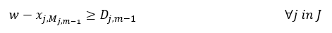

# Job Shop Scheduling using CQM

[Job shop scheduling](https://en.wikipedia.org/wiki/Job-shop_scheduling) is an
optimization problem where the goal is to schedule jobs on a certain number of
machines according to a process order for each job.
The objective is to minimize the length of schedule also called make-span, or 
completion time of the last task of all jobs.

This example demonstrates a means of formulating and optimizing job shop 
scheduling (JSS) using a [constrained quadratic model](
https://docs.ocean.dwavesys.com/en/stable/concepts/cqm.html#cqm-sdk) (CQM) that
can be solved using a Leap hybrid CQM solver.

## Usage

To run the demo, type:

    python job_shop_scheduler.py

The demo program solves a 5 * 5 job shop scheduling problem
(5 jobs and 5 machines) defined by `input/instance_5_5.txt`. The solution
returned by the Leap hybrid CQM solver is then saved to `solution.txt` and the 
scheduling plot is saved to `schedule.png`.

To solve a different problem instance, type:

    python job_shop_scheduler.py -instance <path to your problem file>

There are several instances under `input` folder. Alternatively, a random 
instance file could be generated using `utils/jss_generator.py` as discussed 
under the [Problem generator](#Generating-Problem-Instances) section.

This is an example of a JSS input instance file for a 5 * 5 problem: 
```
5   5
2   4   1   3   0   3   4   2   3   3
4   2   2   1   3   0   1   4   0   2
3   5   4   0   1   5   2   2   0   3
2   2   1   4   4   5   3   1   0   4
2   0   1   4   4   0   0   0   3   5
```

where the first row represents the number of jobs and machines, respectively. 
Each row after represents a job. Every two columns represents one task and 
should be read sequentially. A number in an odd column represents the machine 
required for the task and a number in an even column represents the task's 
processing duration. 

These additional parameters can be passed to `job_shop_scheduler.py`:

    -h, --help          show this help message and exit
    -instance INSTANCE  path to the input instance file; (default: input/instance5_5.txt)
    -tl TL              time limit in seconds (default: None)
    -os OS              path to the output solution file (default: solution.txt)
    -op OP              path to the output plot file (default: shcedule.png)


The program produces a solution schedule like this:

```
                  machine 0               machine 1               machine 2               machine 3               machine 4       
  job id    task    start    dur    task    start    dur    task    start    dur    task    start    dur    task    start    dur
--------  ------  -------  -----  ------  -------  -----  ------  -------  -----  ------  -------  -----  ------  -------  -----
       0       2       11      3       1        8      3       0        3      4       4       20      3       3       17      2
       1       4       21      2       2       16      4       3       13      1       1       14      0       0        4      2
       2       3       18      3       4       11      5       1       16      2       2        3      5       0        8      0
       3       2       14      4       1        4      4       4        0      2       3       13      1       0        8      5
       4       2        8      0       1        0      4       4        0      0       0       14      5       3        6      0

```

The following graphic is an illustration of this solution. 


### Generating Problem Instances

`utils/jss_generator.py` can be used to generate random problem instances.
For example, a 5 * 6 instance with a maximum duration of 8 hours can be
generated with:

`python utils/jss_generator.py 5 6 8 -path < folder location to store generated instance file >`

To see a full description of the options, type:

`python utils/jss_generator.py -h`


## Model and Code Overview

### Problem Parameters

These are the parameters of the problem:


- `n` : is the number of jobs
- `m` : is the number of machines
- `J` : is the set of jobs (`{0,1,2,...,n}`)
- `M` : is the set of machines (`{0,1,2,...,m}`)
- `T` : is the set of tasks (`{0,1,2,...,m}`) that has same dimension as `M`
- `M_(j,t)`:  is the machine that processes task `t` of job `j`
- `T_(j,i)`  : is the task that is processed by machine `i` for job `j` 
- `D_(j,t)`:  is the processing duration that task `t` needs for job `j`
- `V`:  maximum possible make-span

### Variables

- `w` is a positive integer variable that defines the completion time (make-span)
of the JSS
- `x_(j_i)` are positive integer variables used to model start of each job `j` on
  machine `i`
- `y_(j_k,i)` are binaries which define if job `k` precedes job `j` on machine `i`

### Objective

Our objective is to minimize the make-span of the given JSS problem and is simply 
stated as:

```
minimize w
```

### Constraints
#### Precedence Constraint

Our first constraint, [equation 1](#eq2), enforces the precedence constraint.
This ensures that all operations of a job are executed in the given order.

          (1)

This constraint ensures that a task for a given job, `j`, on a machine, `M_(j,t)`,
starts when the previous task is finished. As an example, for consecutive
tasks 4 and 5 of job 3 that run on machine 6 and 1, respectively,
assuming that task 4 takes 12 hours to finish, we add this constraint:
`x_3_6 >= x_3_1 + 12`

#### No-Overlap constraints
Our second constraint, [equation 2](#eq2), ensures that multiple jobs don't use any machine at the same time. 
          (2)

Usually this constraint is modeled as two disjunctive linear constraints 
([Ku et al. 2016](#Ku) and [Manne et al. 1960](#Manne)); however, 
it is more efficient to model this as a single quadratic inequality constraint. 
In addition, using this quadratic equation eliminates the need for using the so called 
`Big M` value to activate or relax constraint
(https://en.wikipedia.org/wiki/Big_M_method). 

The proposed quadratic equation fulfills the same behaviour as the linear
constraints:
There are two cases:
- if `y_j,k,i = 0` job `j` is processed after job `k`:  
     
- if `y_j,k,i = 1` job `k` is processed after job `j`:  
     
  Since these equations are applied to every pair of jobs,
  they guarantee that the jobs don't overlap on a machine.


#### Make-Span Constraint 
The make-span of a JSS problem can be calculated by obtaining the maximum 
completion time for the last task of all jobs. This can be obtained using 
the inequality constraint of [equation3](#eq3)

          (3)

## References

<a id="Manne"></a>
A. S. Manne, On the job-shop scheduling problem, Operations Research , 1960, 
Pages 219-223.


<a id="Ku"></a>
Wen-Yang Ku, J. Christopher Beck, Mixed Integer Programming models for job 
shop scheduling: A computational analysis, Computers & Operations Research,
Volume 73, 2016, Pages 165-173.


## License

Released under the Apache License 2.0. See [LICENSE](LICENSE) file.
