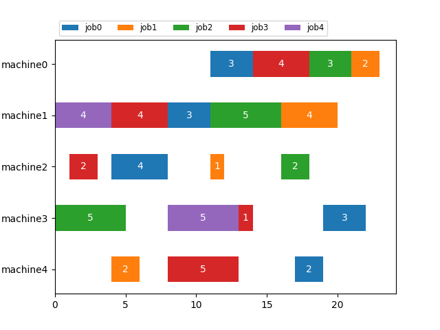

# Job Shop Scheduling using CQM

[Job shop scheduling](https://en.wikipedia.org/wiki/Job-shop_scheduling) is an
optimization problem where the goal is to schedule jobs on a certain number of
machines according to a process order for each job.
The objective is to minimize the length of schedule also called make-span, or 
completion time of the last task of all jobs.

This example demonstrates a means of formulating and optimizing Job Shop 
Scheduling using [constrained quadratic model](
https://docs.ocean.dwavesys.com/en/stable/concepts/cqm.html#cqm-sdk) (CQM) that
can be solved using the D-Wave CQM solver.

## Usage

To run the demo, type:

    python job_shop_scheduler.py

The demo program outputs an optimal solution for a 5 * 5 job shop scheduling 
problem (5 jobs and 5 machines) defined by a problem file.  By default,
the demo program uses the file input/instance_5_5.txt as problem file.

To solve a different problem instance, type:

    python job_shop_scheduler.py -instance <path to your problem file>

These additional parameters can be passed to the job_shop_scheduler.py
  -h, --help    show this help message and exit
  -instance     path to the input instance file
  -tl           time limit in seconds
  -os           path to the output solution file
  -op           path to the output plot file


The program produces a solution file like this:

```
#Number of jobs: 5
#Number of machines: 5
#Completion time: 23.0

#__________________________________________
11   3   8   3   4   4   19   3   17   2
21   2   16  4   11  1   14   0   4    2
18   3   11  5   16  2   0    5   8    0
14   4   4   4   1   2   13   1   8    5
4    0   0   4   0   0   8    5   4    0
```
where each row represent a job. The odd columns are machine numbers with the
processing duration in even columns. 

Following is an illustration of this solution. 




if -os or -op are not passed, the plot is saved as `instance.png` 
and the solution is saved as `instance.sol`

### Generating Problem Instances

To generate random problem instances, for example a 5 by 6 instance
with maximum 8 hours duration type:

    python utils/jss_generator.py -n 5 -m 6 -d 8 -path input

The random problem file is written to the path provided with -path option.


## Model and Code Overview

### Problem Parameters

These are the parameters of the problem:


- `n` : is the number of jobs making set of jobs `J = {0,1,2,...,n}`
- `m` : is the number of machines making set of machines `M = {0,1,2,...,m}`
- `T` : `{0,1,2,...,m}` set of tasks that has same dimension as `M`
- `M_(j,t)`:  is the machine that processes task `t` of job `j`
- `T_(j,i)`  : is the task that is processed by machine `i` for job `j` 
- `D_(j,t)`:  is the processing duration that task `t` needs for job `j`
- `V`:  maximum possible make span

### Variables

- `w` is a positive integer variable that define the completion time (make-span)
of the jJSS
- `x_(j_i)` is positive integer variables used to model start of each job 'j' on
  machine 'i'
- `y_(j_k,i)` is a binary to define if job 'k' precedes job 'j' o

### Objective

Our objective is to minimize the make-span of the given JSS problem and is simply 
stated as:

```
minimize w
```

### Constraints
- #### Precedence Constraint:

Our first constraint, [equation 1](#eq2), enforces the precedence constraint.
This ensures that all operations of a job are executed in the given order.

          (1)

This constraint ensures that for a give job `j` a task on a machine starts when
previous task is finished. As an example for consecutive tasks 4 and 5 of 
job 3, that runs on machine 6 and 1, respectively, and also assuming that 
tasks 4 takes 12 hours to finish we add this constraint:
`x_3_6 >= x_3_1 + 12`

- #### No Overlap constraints
[equation 2](#eq2) ensures that jobs don't use any machine at the same time. 
          (2)

Usually this constraint is modeled as two disjunctive linear constraint 
([Ku et al. (2016)](#Ku) and [Manne et al. 1960](#Manne)), however, it is more efficient to model this as one
single quadratic inequality constraint. 
In addition, using quadratic equation eliminates the need for using the so called 
`Big M` value to activate or relax constraint. 

Assume that there are two jobs 3 and 8 that need to use machine 5, each requiring 
processing duration of 12 and 2 on this machine, respectively.
The following two constraints ensure that these two jobs doesn't use machine 5 
at the same time. 

`x_3,5 + 12 <= x_8,5` and `x_8,5 + 2 <= x_3,5`.

A Binary variable `y_3,8,5` is needed to choose between these two constraints. 
if `y_3,8,5 = 1` we want the first constraint to be enforced and if zero we want
to enforce the second constraint.
If we were modeling this constraint using disjunctive model we need these two
disjunctive linear constraints 
`x_3,5 + 12 <= x_8,5 + y_3,8,5 + V * y_3,8,5`
`x_8,5 + 2 <= x_3,5 + y_3,8,5  + (1- V) * y_3,8,5`
Where `V` is the lowest possible value for `Big M`. 


In the quadratic model the following single constraint will fulfil the same
behaviour

`x_3,5 - x_8,5 - 10 y_3,8,5 + 2 y_3,8,5 (x_8,5 - x_3,5) >= 2`

Depending on the value of `y_3,8,5` one of these constraint ar enforced:

   a) if  `y_3,8,5 = 0` we have `x_3,5 - x_8,5  >= 2` 

   b) if `y_3,8,5 =0`  we have `x_8,5  - x_3,5 >= 12`


- #### Make Span Constraint. 
The make span  of a JSS problem can be calculated by obtaining the maximum of 
completion time of the last task of all jobs. This can be obtaining using the 
inequality constraints of [equation3](#eq3)

          (3)

## References

<a id="Manne"></a>
A. S. Manne, On the job-shop scheduling problem, Operations Research , 1960, 
Pages 219-223.


<a id="Ku"></a>
Wen-Yang Ku, J. Christopher Beck, Mixed Integer Programming models for job 
shop scheduling: A computational analysis, Computers & Operations Research,
Volume 73, 2016, Pages 165-173.


## License

Released under the Apache License 2.0. See [LICENSE](LICENSE) file.
