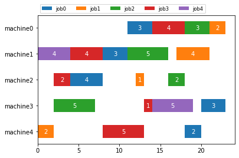
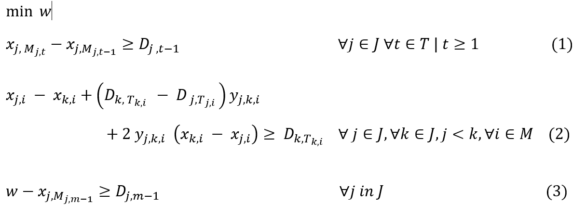

# Job Shop Scheduling using CQM

[Job shop scheduling](https://en.wikipedia.org/wiki/Job-shop_scheduling) is an
optimization problem where the goal is to schedule jobs on a certain number of
machines according to a process order. The objective is to minimize the total 
hours that takes to process all the jobs on all machines.

This example demonstrates a means of formulating and optimizing Job Shop 
Scheduling for a set of jobs that should be processed on a certain of
machines according to a process order and duration. This is done using 
 [constrained quadratic model](
https://docs.ocean.dwavesys.com/en/stable/concepts/cqm.html#cqm-sdk) (CQM) that
can be solved using the D-Wave CQM solver.

## Usage

To run the demo, type:

    python job_shop_scheduler.py

The demo program outputs an optimal solution for a 3 by 3 job shop scheduling 
problem (3 jobs and 3 machines) defined by a problem file.  By default,
the demo program uses the file data/instance_3_3.txt as problem file.

To solve a different problem instance, type:

    python job_shop_scheduler.py --path <path to your problem file>

The program produces an illustration of the solution such as this:

The plot is saved to `output.png`.

### Generating Problem Instances

To generate random problem instances, for example a 5 by 6 instance
with maximum 8 hours duration type:

    python utils/jss_generator.py -n 5 -m 5 -d 8 -path data

The random problem file is written to the path provided with -path option.

Additional parameters are described by:

    python problem_gen.py --help

## Code Overview

We frame the job shop scheduling problem as a constrained optimization problem
with the objective of minimizing total processing times for all jobs. 

Given `N` number of jobs (`{j_1, j_2, ..., j_k, ... j_N }`) and `M` number of
machines where each job `k` needs to be processed on some or all machines 
according to a process order `{P_k_1, P_k_2, ... P_k_m}` and a process duration 
'D' `{D_k_1, D_k_2, ... D_k_m}` the objective is to minimize the total process time.  

Variables:

We define integer variables `x_j_i` to model start of each job 'j' on machine 'i'
We use binary variable 'y_j_k_i' to define if job 'k' precedes job 'j' on machine 'i'
we use one integer variable 'make_span' to define the make span of a jss problem.

Objective of the model:

Our objective is to minimize the make span of the given jss problem.

The constraints of the problem are as follows:

Precedence constraints: Ensures that all operations of a job are executed in the
given order.

### Problem Parameters

These are the parameters of the problem:

- `n` : is the number of jobs making set of jobs `J = {0,1,2,...,n}`
- `m` : is the number of machines making set of machines `M = {0,1,2,...,m}`
- `T` : `{0,1,2,...,m}` set of tasks that has same dimension as `M`
- `M_(j,t)`:  is the machine that processes task `t` of job `j`
- `T_(j,i)`  : is the task that is processed by machine `i` for job `j` 
- `D_(j,t)`:  is the processing duration that task `t` needs for job `j`

### Variables: 

- `w` is a positive integer
- `x_(j_i)` is positive integer 
- `y_(j_k,i)` is a binary

### Constraints

## License

Released under the Apache License 2.0. See [LICENSE](LICENSE) file.
